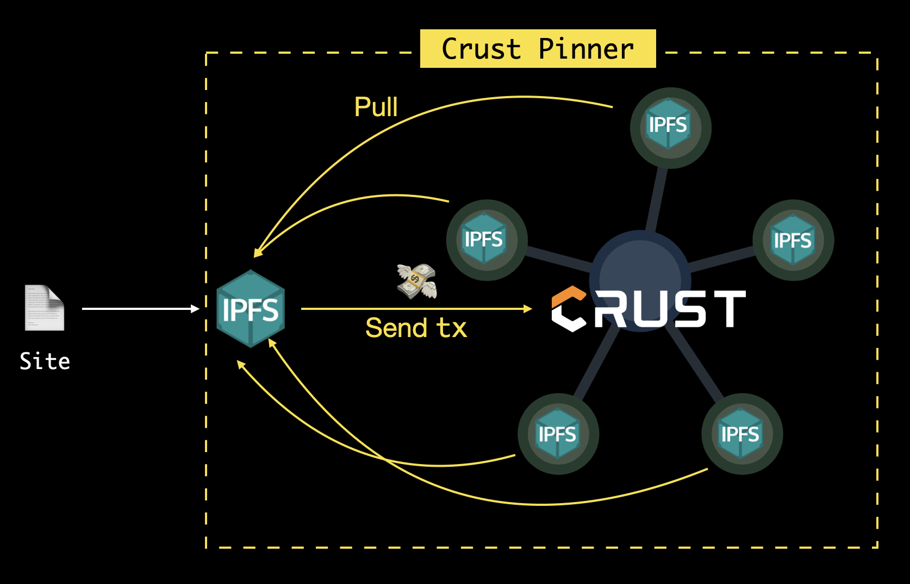

# 📌 Crust Pin

This node package allows you to place a storage order on Crust Network, and the whole network's IPFS storage nodes **will help you to pin your site/file in a super decentralized way**.

## Getting Started

- Install dependency

```shell
yarn add @crustio/crust-pin
```

- Create `CrustPinner`

Typescript sample

```typescript
import CrustPinner from '@crustio/crust-pin';

const crust = new CrustPinner(`${CRUST_ACCOUNT_SEEDS}`);

async function main() {
    await crust.pin('QmVAjL5AkQJ6uwWnJ78YXCVK6FB1cgPtYPRyjnPvoVmb3K');
}

main();
```

or Commonjs sample

```javascript
const crustPin = require('@crustio/crust-pin').default;

const crust = new crustPin(`${CRUST_ACCOUNT_SEEDS}`);

const main = async () => {
    await crust.pin('QmVAjL5AkQJ6uwWnJ78YXCVK6FB1cgPtYPRyjnPvoVmb3K');
}

main();
```

## Workflow

The whole workflow shows like blew:



Simply to say, Crust Pin only handles the **tx-sending**. After that, the storage nodes which received this tx will pull the site from user's IPFS.

## Contribution
  
  Please send a PR(Pull Request) to contribute this repo and read the following rules:

  1. **No `--force` pushes** or modifying the master branch history in any way. If you need to rebase, ensure you do it in your own repo.
  2. **Non-main branches**, prefixed with a short name moniker (e.g. zik/my-feature) must be used for ongoing work.
  3. **All modifications** must be made in **pull-request** to solicit feedback from other contributors.
  4. A pull-request **must not be merged until CI** has finished successfully.
  5. Contributors should adhere to the [Google Typescript Style Guide](https://github.com/google/gts).
